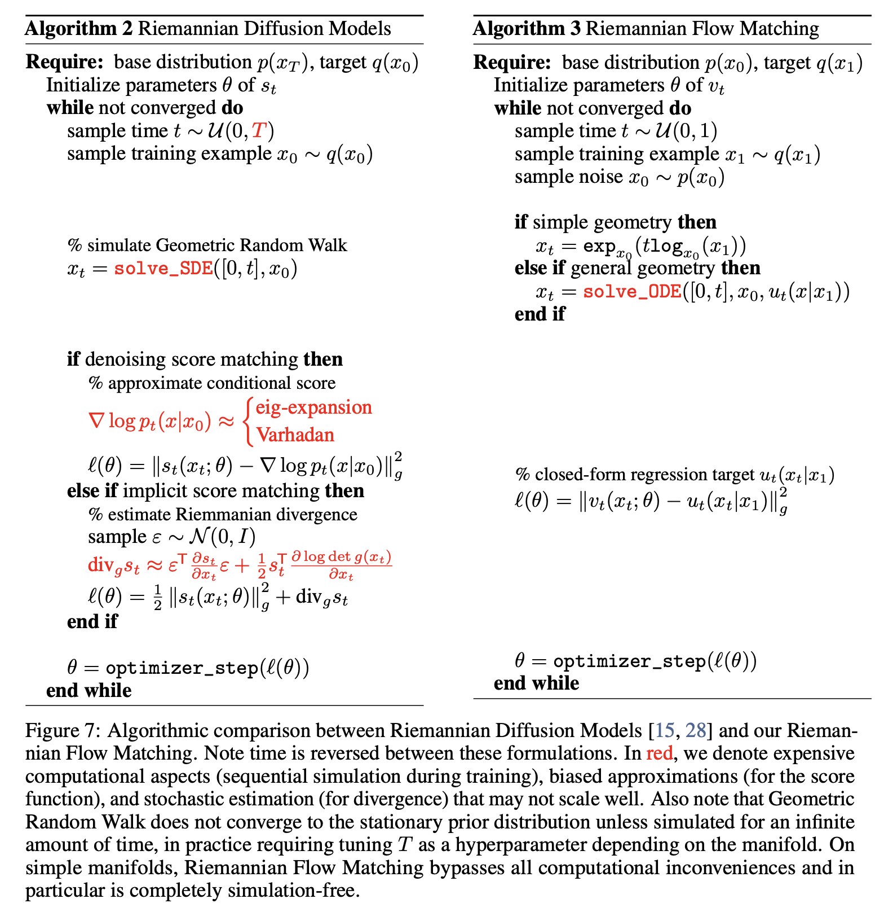

# Riemannian Flow Matching on General Geometries

<div align="center">

[](https://arxiv.org/abs/2302.03660)
[](https://twitter.com/RickyTQChen/status/1625841068641230848)

</div>

<p align="center">

</p>

### Why Riemannian Flow Matching?

  - Completely simulation-free on simple manifolds,
  - Trivially applies to higher dimensions with no approximation errors,
  - Tractably generalizes to general geometries!

Algorithmic comparison to related Riemanninan diffusion models:

<p align="center">

</p>

## Installation

```
conda env create -f environment.yml
pip install -e .
```

## Data

Download zip file [here](https://rtqichen.com/manifold_data/data.zip) and uncompress into `data` folder.

Modify the `*_datadir` variables inside `configs/train.yaml`.

Protein data:
```
cd data/top500
bash batch_download.sh -f list_file.txt -p
python get_torsion_angle.py
```

RNA data:
```
cd data/rna
bash batch_download.sh -f list_file.txt -p
python get_torsion_angles.py
```

Mesh data:
```
cd data
python synthesize_mesh_data.py
```

## Manifolds

The following manifolds (`manifm/manifolds`) are supported:
  - Euclidean
  - FlatTorus
  - Sphere
  - PoincareBall
  - SPD (symmetric positive definite matrices)
  - Mesh

With the only exception being `Mesh`, the other manifolds are "simple" (i.e., has closed-form geodesic paths).

## Experiments

```
python train.py experiment=<experiment> seed=0,1,2,3,4 -m
```
where `<experiment>` is one of the settings in `configs/experiment/*.yaml`.

## Citations
If you find this repository helpful for your publications,
please consider citing our paper:

```
@inproceedings{
    chen2023riemannianfm,
    title={Riemannian Flow Matching on General Geodesics},
    author={Ricky T. Q. Chen and Yaron Lipman},
    year={2023},
}
```

## License
This repository is licensed under the
[CC BY-NC 4.0 License](https://creativecommons.org/licenses/by-nc/4.0/).